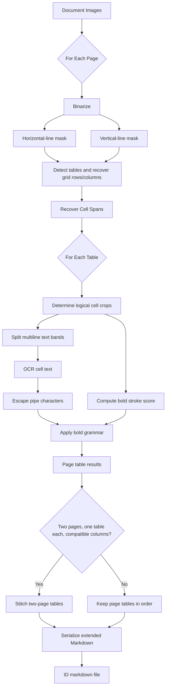

```mermaid
flowchart TD
    A[Document Images] --> B{For Each Page}
    B --> C[Binarize]

    C --> D[Horizontal-line mask]
    C --> E[Vertical-line mask]
    D --> F[Detect tables and recover grid rows/columns]
    E --> F

    F --> G[Recover Cell Spans]
    G --> H{For Each Table}
    H --> I[Determine logical cell crops]

    I --> J[Split multiline text bands]
    J --> K[OCR cell text]
    K --> L[Escape pipe characters]

    I --> M[Compute bold stroke score]
    L --> N[Apply bold grammar]
    M --> N
    N --> O[Page table results]

    O --> P{Two pages, one table each, compatible columns?}
    P -->|Yes| Q[Stitch two-page tables]
    P -->|No| R[Keep page tables in order]
    Q --> S[Serialize extended Markdown]
    R --> S
    S --> T[ID markdown file]
```
