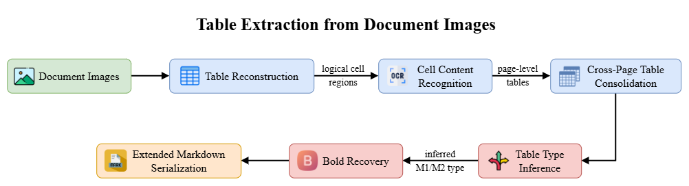
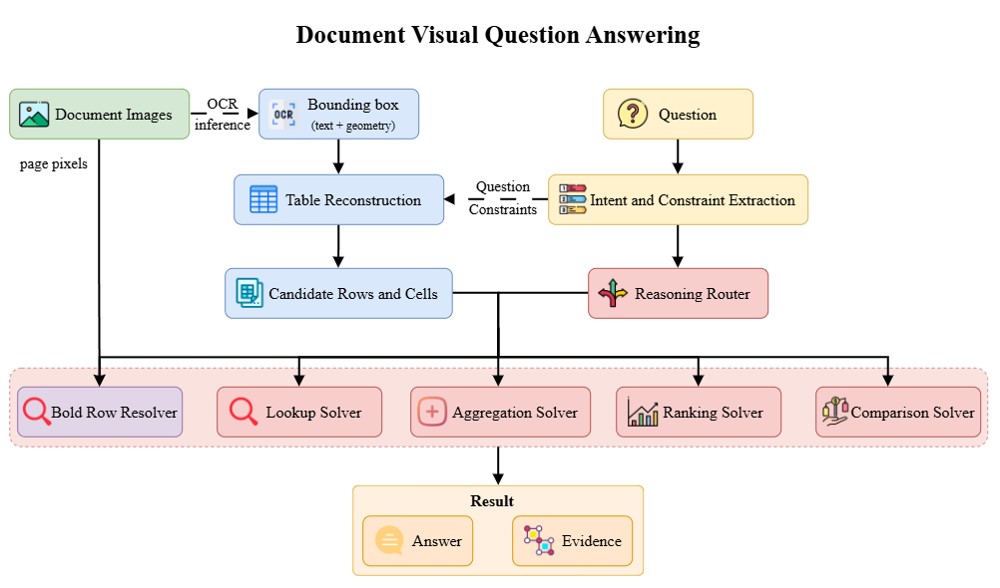

# OLP AI PTIT 2026 — Preliminary Round

This repository contains solutions for the document intelligence tasks in the OLP AI PTIT 2026 preliminary round.

## Tasks

### Doc2Table

Reconstruct structured tables from document images, including cell recognition, table-type inference, and cross-page consolidation.



The `Doc2Table/` workspace is still being organized.

### DocViVQA

Answer questions over Vietnamese document images using OCR geometry, table reconstruction, intent routing, and specialized reasoning solvers.



See [DocViVQA/README.md](DocViVQA/README.md) for its structure and execution pipeline.

## Repository structure

```text
.
├── assets/       # Architecture and pipeline diagrams
├── Doc2Table/    # Document-to-table solution
└── DocViVQA/     # Visual document question-answering solution
```
